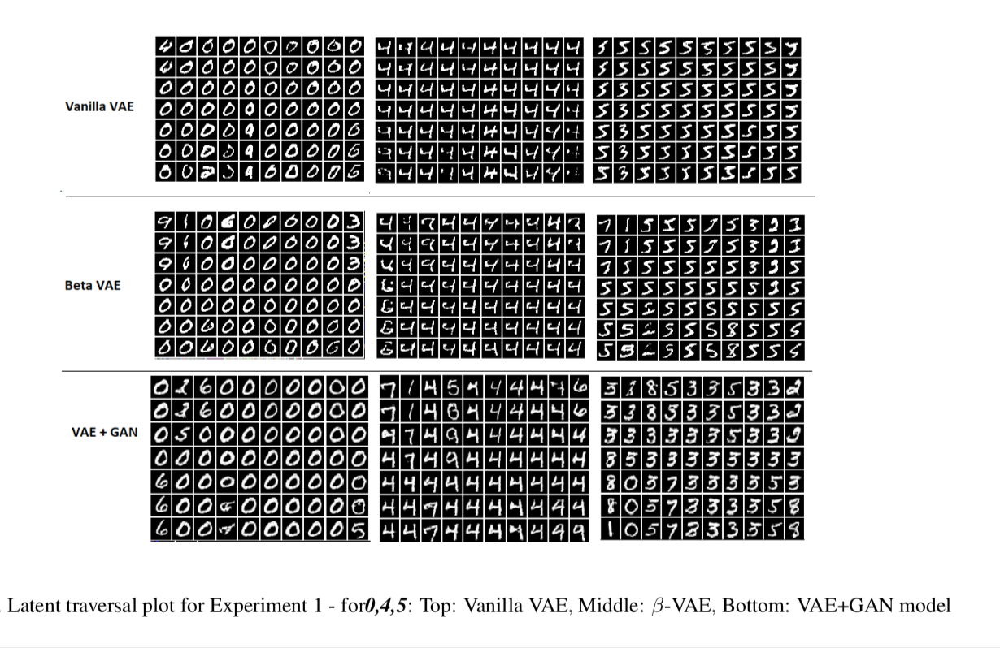
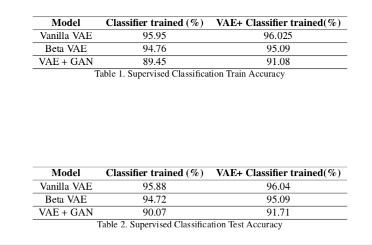

# Final Course Project - Learning Disentangled Latent Spaces using Variational Autoencoder

**Report** - [Final Report](report.pdf)

## Repository contains implementation for following generative models:

### Variational Autoencoder
* [Variational Autoencoder (Kingma 2013)](https://arxiv.org/abs/1312.6114) ([code](code/VAE_+_Classifier.ipynb))

* [β-VAE (Higgins 2017)](https://openreview.net/forum?id=Sy2fzU9gl)([code](code/beta_vae+classifier.ipynb))
* [Autoencoding beyond pixels using a learned similarity metric](https://arxiv.org/abs/1512.09300)([code](code/symmetric_vae.ipynb))

### GAN
* [GAN](https://arxiv.org/abs/1406.2661)([code](code/VAE+GAN.ipynb)
* [DCGAN](https://arxiv.org/abs/1511.06434)([code](code/VAE+GAN.ipynb)
* [InfoGAN](https://arxiv.org/abs/1606.03657)([code](code/InfoGAN.ipynb)

### Evaluation
#### Latent Traversal Results:

### Classification Results:

